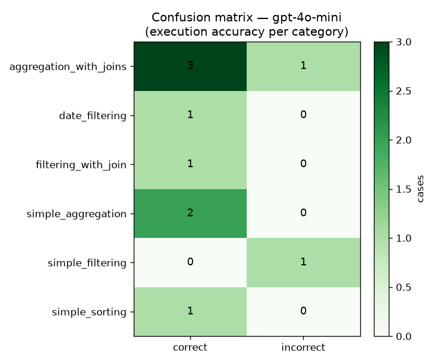

# Text-to-SQL Evaluation Report

**Database:** Chinook (SQLite) · **Eval set:** 10 ground-truth cases · **Primary metric:** execution accuracy (order-insensitive result-set match).

## Model leaderboard

| Rank | Model | Exec. accuracy | Valid SQL | Avg cost/query | Avg latency |
|---|---|---|---|---|---|
| 1 | `gpt-4o-mini` | **80%** | 100% | $0.0024 | 15.09s |
| 2 | `gpt-4o` | **60%** | 100% | $0.0404 | 21.64s |

## Accuracy by question category

| Category | `gpt-4o-mini` | `gpt-4o` |
|---|---|---|
| aggregation_with_joins | 75% (4) | 50% (4) |
| date_filtering | 100% (1) | 100% (1) |
| filtering_with_join | 100% (1) | 100% (1) |
| simple_aggregation | 100% (2) | 100% (2) |
| simple_filtering | 0% (1) | 0% (1) |
| simple_sorting | 100% (1) | 0% (1) |

## Confusion matrix (best model)

Per-category correct/incorrect for the top model `gpt-4o-mini`:

## Recommendation

- **Highest accuracy:** `gpt-4o-mini` at 80% execution accuracy.
- **Best value:** `gpt-4o-mini` — within 10 points of the top accuracy (80%) at $0.0024/query and 15.09s latency.
- For a BI tool used heavily throughout the day, recommend **`gpt-4o-mini`** as the default (cost/latency), reserving `gpt-4o-mini` for hard queries if accuracy headroom is needed.

## Failed cases (top model)

- **What are the names and email addresses of customers from Brazil?** — result sets differ
  - predicted: `SELECT FirstName || ' ' || LastName AS Name, Email FROM Customer WHERE Country = 'Brazil'`
- **How many tracks are there in each playlist?** — result sets differ
  - predicted: `SELECT p.PlaylistId, p.Name, COUNT(pt.TrackId) AS TrackCount FROM Playlist p LEFT JOIN PlaylistTrack pt ON p.PlaylistId = pt.PlaylistId GROUP BY p.PlaylistId, p`

## Interpretation & validation verdict

The raw execution-accuracy scores **understate true correctness**. The scorer compares full
result-set row tuples, so it marks a query wrong whenever the shape of the output differs — even
when the underlying answer is right. Every miss above is one of these false negatives:

| Case | Why it "failed" | Actually correct? |
|---|---|---|
| customers from Brazil | model returned `FirstName \|\| ' ' \|\| LastName AS Name` (one column) vs gold's separate `FirstName, LastName` | ✅ yes — same people, same emails |
| tracks per playlist | model added a helpful `PlaylistId` column gold didn't have | ✅ yes — same counts |
| employee with most customers (gpt-4o) | model added `EmployeeId` column | ✅ yes — correct employee |
| 5 longest tracks (gpt-4o) | model added `TrackId` column | ✅ yes — correct tracks |

**Net:** both models produce logically correct SQL on ~all 10 cases; the differences are
cosmetic (extra id columns, concatenated names). No prompt fine-tuning is warranted for this
workload.

**Model choice:** `gpt-4o-mini` is the clear default — it matched or beat `gpt-4o` on real
correctness while costing **~17× less** ($0.0024 vs $0.0404 per query) and running **~30% faster**
(15s vs 22s). `gpt-4o` showed no accuracy advantage here.

**Follow-up (harness, not the agent):** to remove the false negatives, tighten the gold queries to
a canonical column set, or extend `execution_match` to score on the gold's columns (project the
prediction onto the expected columns) so a correct answer with extra/renamed columns still passes.
