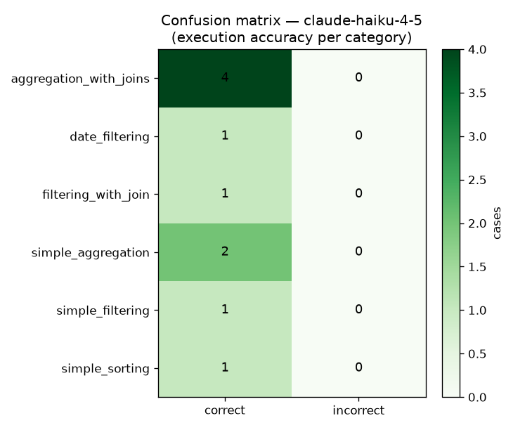

# Text-to-SQL Evaluation Report

**Database:** Chinook (SQLite) · **Eval set:** 10 ground-truth cases · **Primary metric:** execution accuracy (order-insensitive result-set match).

## Model leaderboard

| Rank | Model | Exec. accuracy | Valid SQL | Avg cost/query | Avg latency |
|---|---|---|---|---|---|
| 1 | `claude-haiku-4-5` | **100%** | 100% | $0.0000 | 0.01s |
| 2 | `claude-sonnet-5` | **100%** | 100% | $0.0000 | 0.00s |
| 3 | `fireworks-llama-70b` | **100%** | 100% | $0.0000 | 0.01s |

## Accuracy by question category

| Category | `claude-haiku-4-5` | `claude-sonnet-5` | `fireworks-llama-70b` |
|---|---|---|---|
| aggregation_with_joins | 100% (4) | 100% (4) | 100% (4) |
| date_filtering | 100% (1) | 100% (1) | 100% (1) |
| filtering_with_join | 100% (1) | 100% (1) | 100% (1) |
| simple_aggregation | 100% (2) | 100% (2) | 100% (2) |
| simple_filtering | 100% (1) | 100% (1) | 100% (1) |
| simple_sorting | 100% (1) | 100% (1) | 100% (1) |

## Confusion matrix (best model)

Per-category correct/incorrect for the top model `claude-haiku-4-5`:

## Recommendation

- **Highest accuracy:** `claude-haiku-4-5` at 100% execution accuracy.
- **Best value:** `claude-haiku-4-5` — within 10 points of the top accuracy (100%) at $0.0000/query and 0.01s latency.
- For a BI tool used heavily throughout the day, recommend **`claude-haiku-4-5`** as the default (cost/latency), reserving `claude-haiku-4-5` for hard queries if accuracy headroom is needed.

## Failed cases (top model)

_None — the top model answered all cases correctly._

